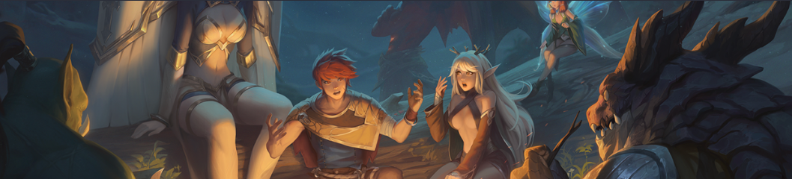
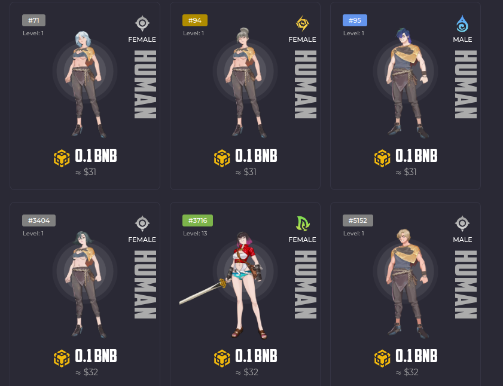
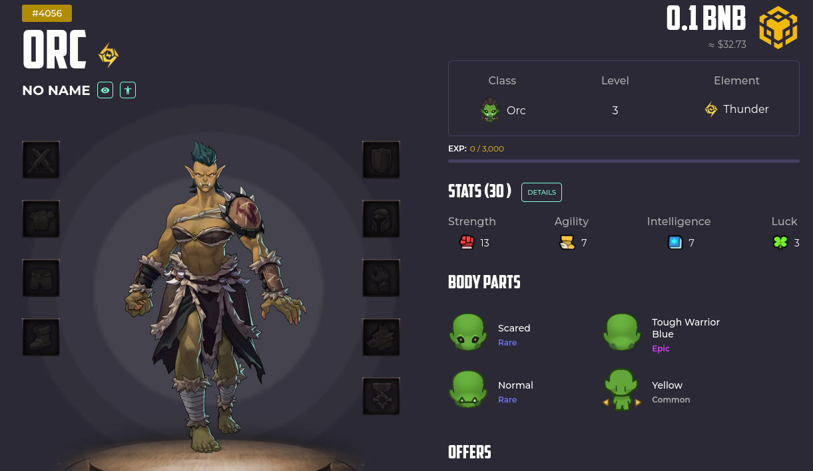

# Faraland について

## Faraland（ファラランド）とは
Faraland はベトナムの **MoonKnight Labs** が開発している、BSC（バイナンススマートチェーン）上のBCG（ブロックチェーンゲーム）です。iphone や Android でプレーできます。

[Faraland 公式](https://faraland.io/)

ゲームで使用するキャラクタ（Faraland では**ヒーロー**と呼ぶ）はNFTで、ヒューマンやオーク、エルフなど7つの種族と数百種類のボディパーツがあります。装備も一つ一つがNFTで、各ヒーローはそれらを装備することで強くなります。

いわゆる**P2E（Play To Earn）**をうたってはいますが、現時点で投資額以上に稼ぐことは難しいでしょう。私も稼げるからというより**ゲームとして面白い**から続けています。

 

## **Faraland の魅力**

Faraland はブロックチェーンゲームとして沢山の魅力がありますが、私が気に入っている点は以下です。

### **ユニークで個性的なNFTヒーロー**

[マーケットプレース](https://faraland.io/heroes) を見ればわかりますが、FaralandのNFTヒーローは一つとして同じものがありません。種族や性別、ボディパーツ、エレメント、ステータスなどそれぞれ違います。NFTヒーローは**全部で20000体**しか発行（mint）されておらず、これ以上増える予定もありません。

また一人のヒーローが持つボディパーツの数は通常は4つですが、まれに5、もしくは6つのボディーパーツをもつヒーローがいます。ボディーパーツの数が増えると、ステータスも高くなります。またボディパーツそれぞれにもランクが設定されていて、エピックや、レジェンダリ、ミシカルなどがあります。ランクが上がると、スキル効果などがアップします。

### **膨大な種類の装備・アイテム**
また驚きなのが、ヒーローが身につけられる装備やアイテムの豊富さとかっこよさです。[装備マーケットプレース](https://faraland.io/equipment)を見ると、さまざまな種類の武器や鎧、盾などの装備品、アイテムなどがあることがわかるでしょう。多くの装備はセットがあり、同じ種類の装備セットを装備するとボーナスステータスを得ることができます。

しかも各装備にはランクやティアがあり、ティア1からティア3までアップグレードすることができます。しかもアップグレードすると見た目も大きく変化し、同じ装備でも種族や性別が変わると装備したときの見た目も変わるという、大変凝った作りになっています。そのため、自分のNFTヒーローにいろいろな装備をさせて、それを見てみるだけでも楽しいです。

### **多彩なジョブとスキル**
7つの各種族（ヒューマン、オーク、エルフ、フェアリー、ドラゴン、デーモン、エンジェル）はそれぞれ固有のスキルをもっており、選んだスキル系統によって3つのジョブに分かれることになります。使いたいスキルにスキルポイントを割り振ることで習得できます。ただし、現状すべてのスキルが使えるわけではなく、まだ開発中のものが多いです。

## 種族とジョブ
いくつかの種族とそのジョブを紹介します。

 

### **ヒューマン**

ヒューマンは最も数が多い種族ですが、他の種族に比べて特別弱いわけではありません。使える装備の種類も豊富です。マーケットプレースでの値段も安いので初心者向きと言えます。

#### **パラディン**
防御力と支援スキルを持つタンカーです。盾を使った技が得意です。

#### **ブレード・ダンサー**
高い機動力と大きな物理ダメージを持つ暗殺者です。ダガーなどの両手武器を使いこなします。

#### **スペル・シンガー**
いわゆる魔法使いです。高い知能を持ち攻撃魔法を得意としています。

 

### **オーク**

オークは高いHPと強い力を持ちます。斧を使うのが得意です。そのため多くは接近戦で戦いますが、まれに魔法を得意とするオークも存在します。

#### **ウォーリアー**
オークの正統な戦士です。強力な攻撃力と優れた防御力を持ちます。

#### **バーサーカー**
狂戦士です。ウォーリアーとは異なるスキルを持ち、両手武器を使うのが得意です。

#### **ワーロード・シャーマン**
珍しいオークの祈祷師です。独特な魔法を使います。

 

### **エルフ**

エルフは森を愛しており、高い敏捷性をもっています。弓を使うのが得意ですが、高い機動力を活かした接近戦を得意とするエルフもいます。

#### **ウインド・ハンター**
遠距離攻撃が得意なハンターです。弓を使って強力な攻撃を行います。

#### **フォレスト・ゴースト**
エルフのエリート戦士で優れた敏捷性と戦闘能力を持ちます。二刀流を使いステルススキルが得意です。

#### **ネイチャー・キーパー**
自然の番人で、深い森に潜み罠を仕掛けます。不意打ちも得意です。

 

## **種族の選び方**
ここまでヒューマン、オーク、エルフを紹介しました。初心者は値段がお手頃な、この3つの種族の中から3体選べばよいです。

    ヒューマン - ヒューマン - ヒューマン

でもよいのですが、できれば

    ヒューマン - ヒューマン - オーク

とか、

    ヒューマン - オーク - エルフ

などをおすすめします。種族を分けたほうが使えるスキルの幅が広がるからです。

予算に余裕があれば、フェアリー以上の上級種族を入れてもいいでしょう。彼らは羽持ちなので空を飛べてスキルも強いのですが、数が少なく値段が高いのがネックです。装備の種類も限られてきます。

 

## **ゲームモード**
FaralandのゲームモードにはPvEとPvPがあります。

### **PvE**
PvEはいわゆるロールプレイングゲームです。

マップの中の町や村、城などを移動しNPCから依頼（クエスト）を受け、依頼を実行したりモンスターと戦ったりします。モンスターを倒したり依頼をクリアすると、経験値やコイン、ソールストーン、マテリアルなどを手に入れることができます。まれにボスキャラと戦うこともできますが、かなり強いので、低、中レベルのキャラや装備でボスを倒すのは無理です。

### **PvP**
PvPは他のプレーヤーと戦う対戦ゲームです。

ターン制ストラテジー型対戦ゲームで、3体のヒーロー同士で武器やスキルを駆使して戦います。相手のヒーローをすべて倒せば勝利です。定期的にトーナメントが開催されており、上位に入ることで仮想通貨やアイテムなどの報酬を得ることができます。6桁の数字を共有することで特定の人とだけ対戦できるロビーモードもあります。

